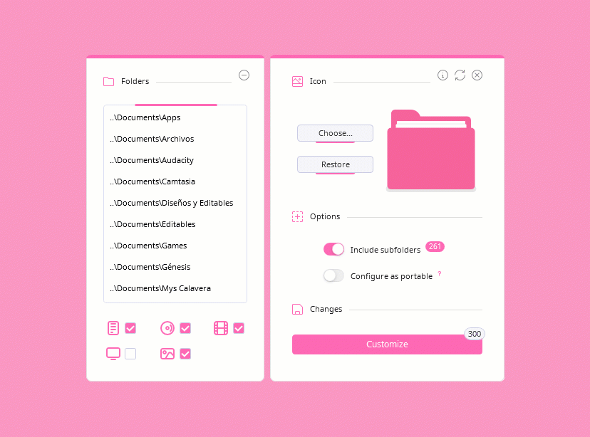
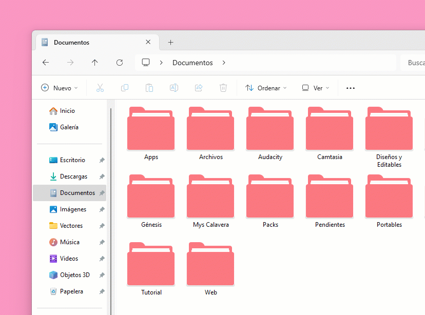

Crystal Folders is an app to customize your folder icons in a few seconds, for Windows.

## Features
* Customize many folders in a few seconds.
* Add folders located inside Documents, Pictures, etc. with one click
* Drag and drop option.
* Choose from seven default icon colors or your own.
* Option to include subfolders.
* Possibility to remove directories from the list once added.
* Displays folders and subfolders number to customize.
* Option to create portable folders with a custom icon. [𝐢](#details)
* Avoid duplication of folders that have been previously added.
* Notifications directly on the desktop.
* Avoid customizing folders with system icons.
* Switch between English and Spanish language.
* Save settings in a .ini file, except for switches.
* Customize theme color.
* Modifying the Desktop.ini file without losing information.
* Adaptive corners (rounded or metro), depending on the OS version.

## Preview
<picture></picture>

## Usage
On the left panel there is an area where the directories or folder list to customize will be displayed. Below you'll find icons with their respective checkboxes, which are: Documents, Pictures, Music, Videos and Desktop.

 

𝟭. **Add folders**, there are two ways:
* Check the box(es) you want to customize, for example: if you selected _Documents_, all the folders inside will be added to the list. You can uncheck them at any time to remove those directories.
* By dragging and dropping folders into the empty area mentioned above, even if you've already checked boxes.

To remove folders one by one, you must select it in the list and click on **⦵**.

𝟮. **Choose an icon:**
   On the right panel press the `Choose…` button, a small window will open with seven default icon colors or you could search and use your own, it just needs to be in ICO format. Once you select it and press `Open`, it will appear in the preview.

𝟯. **Add subfolders:**
   Further down you can turn on `Add subfolders` switch, which will also indicate the total number of. If you find there are too many or you aren't interested, simply turn it off (this only helps to get a better customization experience).

 

>We will skip the second switch for now.

 

𝟰. **Customize all:**
   Finally, press the `Customize` button, which, likewise, indicates the total number of folders whose icons will be changed. Once this is done, a small waiting window will be displayed and then a notification on your desktop confirming that it has completed successfully.
   
If the folders number exceeds 600, a message will appear asking if you want to continue, however, the default recommended button is `No` in case you prefer to decrease it.

☑️ That’s it, it’s that easy! Now all that’s left to do is look at your customized folders; if you don’t see any changes, just refresh the window and/or desktop.

Remember, to clear the list or chosen options just click on **⟳**.

 

### Restore folders:

𝟭. You'll need to follow the first steps again; checking the boxes or dragging and dropping them to the list. Only now instead of choosing a new icon, you'll have to click on `Restore` button and as you can see, a little arrow will appear in what would be the preview to indicate this action.

𝟮. The switch below has changed to `Restore subfolders`, turn that on if you’ve customized them before.

𝟯. Finally, click on the second `Restore` button. The small waiting window will appear again, then the notification on the desktop that it has been completed and that’s it, your folders are back to normal.

 

<video controls><source src="https://github.com/user-attachments/assets/73cf3966-5187-4815-a3ec-11620f39fc35" type="video/mp4"></video>

 

### Folders with customized icons on another PC:

The second switch `Configure to portable` allows you to customize the icon for up to 30 folders (including subfolders) to be displayed with that icon on any other computer, since it copies it inside. This option only works by dragging them to the list area; if any box is checked on the left panel, the switch cannot be turned on.

In the same way, when restoring a folder with a portable icon you'll need to follow the same steps, just remember to turn on `Restore from portable` switch.

 

### Info button:

Click on the upper Info button, a new window will appear where you can:

- **Change theme:** Click on `Change Theme` to open the color picker and choose a custom one, then click Apply. To return to default values, repeat the previous steps and press the purple button below the tone selector. Finally click Apply.

- **Change language:** In the **Language** section below, click on the little arrows icon to change between English or Español, finally click on the return button to apply and see changes.
     
- **Third-party content:** On the left side are the names of each library, project, icons or fonts that were used, click one to read its license and author(s), as well as a short description. You can click on the clip icon to go to each repository/official site and change pages with **Next 🢖🢖** or **🢔🢔 Back**.

 

<picture></picture>

 

### Security measures:

* You cannot customize special folders that already have a system icon, such as _Documents_ or _Pictures_, only directories inside it.
* There are folders whose icon cannot be changed due to their protection level or privileges, so a notification will be displayed on the desktop warning about how many have been skipped.
* It directly modifies the Desktop.ini file, thus avoiding deleting it and creating a new one without losing its information.
* Folders limit message, once the amount of 600 has been exceeded; to disable this message open the `Config.ini` file and change `Message = true` to `Message = false`.

 

## Info
* This software is under **MIT License** ([read full text](https://github.com/genesistoxical/cystal-folders/blob/master/LICENSE){:target="_blank"}).
* `🤍 Custom Folder` Create your own custom icon folder: [genesistoxical.github.io/customfolder](https://genesistoxical.github.io/customfolder/){:target="_blank"}.
* `🤍 Image to Icon` Convert image to icon online: [genesistoxical.github.io/imagetoicon](https://genesistoxical.github.io/imagetoicon/){:target="_blank"}.
* `🤍 Drop Icons` App to convert images to icons (.ico) for Windows: [Download](https://genesistoxical.github.io/drop-icons/){:target="_blank"}.
* Copyright (c) 2025 Génesis Toxical.

 

